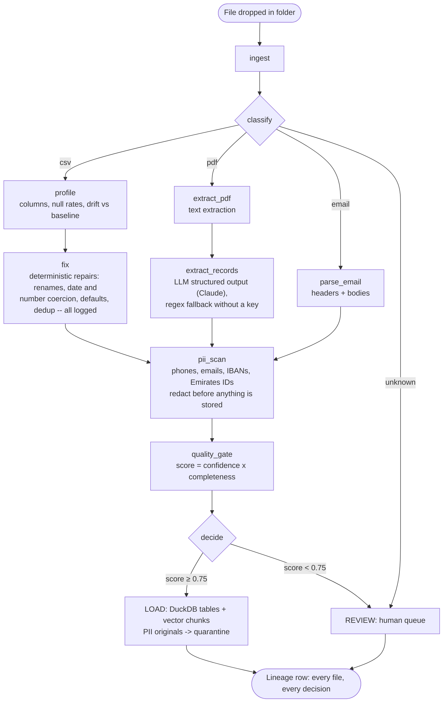

# Data Refinery

A LangGraph agent that turns the messy, mixed-format files companies actually have -- drifting CSVs, invoice PDFs, email exports full of phone numbers -- into governed, PII-safe, AI-ready datasets: typed DuckDB tables, a local vector index for RAG, a quarantine folder, and a lineage trail for every file.

[](https://github.com/MONISMALIK1/data-refinery/actions/workflows/tests.yml)

## The problem

Most enterprise data is unstructured, scattered, and full of personal data -- and none of it can legally or usefully feed an LLM as-is. "Our data isn't AI-ready" is the blocker behind most stalled AI projects, ahead of models or cost. The mechanical failures are always the same: a vendor renames a column, dates switch format, amounts grow currency symbols, duplicates creep in, and somewhere in the pile there are phone numbers and ID numbers that must never reach a warehouse table or a vector index.

## What one command produces

```
python refine.py demo_data/ --fresh
```

Drop a folder containing a clean CSV, a drifted CSV, three invoice PDFs, and an email export -- get back:

- **A DuckDB warehouse you can SQL**: typed `transactions`, `invoices`, and `documents` tables.
- **A vector index you can query**: `python ask.py "How much do we owe Gulf Office Supplies?"` answers with source-file citations.
- **A quarantine folder**: originals containing PII, each with a findings report; only redacted content is stored.
- **A review queue**: files the pipeline was not confident about (like an invoice with no total) are held for a human instead of guessed at.
- **A lineage table**: every file's classification, repairs, PII findings, quality score, and decision -- including the rejections.

## Architecture

The same tiered discipline as production data platforms: deterministic code handles everything with one correct answer; the LLM is reserved for genuinely unstructured extraction; a human gets everything the pipeline cannot vouch for.



Design rules the graph enforces:

- **The PII scan is unconditional.** Nothing reaches the warehouse or the embedding index unredacted, because an embedding cannot be un-trained from the text that produced it.
- **The router is never a model call.** Classification is extension + content sniffing; a misrouted file is the hardest failure to debug downstream.
- **Repairs are code, not prompts.** A renamed column or a `1,200.50` amount has one correct answer, so it is fixed deterministically and logged. The LLM only sees genuinely unstructured documents.
- **The graph is pure.** No database writes or file moves inside nodes -- all side effects live in the CLI and warehouse layer, which is what makes the pipeline re-runnable and testable.
- **Low confidence is a first-class outcome.** The quality gate (extractor confidence x field completeness) sends doubtful files to review instead of loading guesses.

## Quickstart

```bash
git clone https://github.com/MONISMALIK1/data-refinery.git
cd data-refinery
python3 -m venv .venv && source .venv/bin/activate
pip install -r requirements.txt

# Optional: enables Claude for invoice extraction and RAG answers.
# Without it, extraction falls back to deterministic parsing and
# RAG returns cited passages (extractive mode).
export ANTHROPIC_API_KEY=sk-ant-...

python refine.py demo_data/ --fresh
python ask.py "How much do we owe Gulf Office Supplies and when is it due?"
```

Then explore the warehouse directly:

```sql
-- duckdb warehouse.duckdb
SELECT * FROM transactions;
SELECT source_file, decision, quality_score, pii_types FROM lineage;
```

## Tests

30 offline tests: fixers, PII redaction (including false-positive guards for invoice numbers), extraction, quality gates, embeddings, the warehouse, RAG citations, and full graph runs with injected fake extractors. No API key or network needed.

```bash
pip install -r requirements-dev.txt
pytest -v
```

## Project structure

```
refinery/
    models.py      Pydantic extraction schemas (the LLM cannot return anything else)
    config.py      Baseline contracts and thresholds
    classify.py    File-type routing (deterministic)
    profiling.py   CSV profiling and drift detection
    fixers.py      Deterministic repairs, all logged
    pii.py         PII detection and redaction (phones, emails, IBAN, Emirates ID)
    extract.py     ClaudeExtractor (structured output) + regex fallback
    quality.py     Quality gate: confidence x completeness
    embedding.py   Local hashed embeddings (no downloads, CI-identical)
    warehouse.py   DuckDB tables, vector chunks, lineage
    rag.py         Retrieval + cited answers (Claude or extractive)
    graph.py       LangGraph assembly
refine.py          CLI: folder in, warehouse out
ask.py             CLI: RAG questions with citations
demo_data/         The demo folder described above
scripts/           Demo-data generator (dev-only)
tests/             Offline test suite
```

## Extending

- **New feed type:** add a baseline contract in `config.py` and a branch in `classify`; the fixer, PII, and gate tiers are already generic.
- **Neural embeddings:** replace the two functions in `embedding.py`; nothing else changes.
- **Human-in-the-loop:** the REVIEW decision is the natural place for LangGraph `interrupt()` and a resumable checkpointer.
- **Model choice:** set `REFINERY_MODEL` (defaults to `claude-sonnet-5`).

See [docs/architecture.md](docs/architecture.md) for node-by-node detail and known limitations.

## License

MIT
